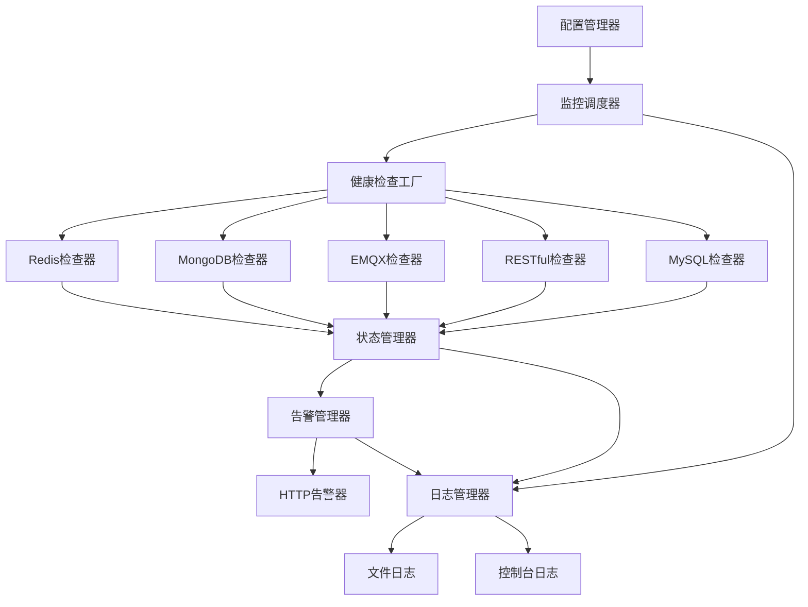

# 设计文档

## 概述

服务健康监控系统是一个基于Python的模块化监控解决方案，采用插件化架构设计，支持多种服务类型的健康检查和灵活的告警机制。系统通过YAML配置文件进行管理，支持动态配置更新，并提供完整的日志记录功能。

## 架构

### 整体架构图



### 核心组件

1. **配置管理器 (ConfigManager)**: 负责YAML配置文件的加载、解析和热更新
2. **监控调度器 (MonitorScheduler)**: 管理所有健康检查任务的调度和执行
3. **健康检查工厂 (HealthCheckerFactory)**: 创建和管理不同类型的健康检查器
4. **状态管理器 (StateManager)**: 管理服务状态变化和状态历史
5. **告警管理器 (AlertManager)**: 处理告警触发和通知发送
6. **日志管理器 (LogManager)**: 统一的日志记录和管理

## 组件和接口

### 1. 抽象健康检查器接口

```python
from abc import ABC, abstractmethod
from dataclasses import dataclass
from typing import Dict, Any, Optional
from datetime import datetime

@dataclass
class HealthCheckResult:
    service_name: str
    service_type: str
    is_healthy: bool
    response_time: float
    error_message: Optional[str] = None
    timestamp: datetime = None
    metadata: Dict[str, Any] = None

class BaseHealthChecker(ABC):
    def __init__(self, name: str, config: Dict[str, Any]):
        self.name = name
        self.config = config
    
    @abstractmethod
    async def check_health(self) -> HealthCheckResult:
        """执行健康检查并返回结果"""
        pass
    
    @abstractmethod
    def validate_config(self) -> bool:
        """验证配置参数是否有效"""
        pass
```

### 2. 具体健康检查器实现

#### Redis健康检查器
```python
class RedisHealthChecker(BaseHealthChecker):
    async def check_health(self) -> HealthCheckResult:
        # 实现Redis连接测试和PING命令
        # 测量响应时间
        # 可选：执行简单的SET/GET操作
        pass
```

#### MongoDB健康检查器
```python
class MongoHealthChecker(BaseHealthChecker):
    async def check_health(self) -> HealthCheckResult:
        # 实现MongoDB连接测试
        # 执行ping命令
        # 可选：执行简单的查询操作
        pass
```

#### EMQX健康检查器
```python
class EMQXHealthChecker(BaseHealthChecker):
    async def check_health(self) -> HealthCheckResult:
        # 实现MQTT连接测试
        # 或通过HTTP API检查EMQX状态
        # 测试发布/订阅功能
        pass
```

#### RESTful接口健康检查器
```python
class RestfulHealthChecker(BaseHealthChecker):
    async def check_health(self) -> HealthCheckResult:
        # 发送HTTP请求到指定端点
        # 检查响应状态码
        # 测量响应时间
        # 可选：验证响应内容
        pass
```

#### MySQL健康检查器
```python
class MySQLHealthChecker(BaseHealthChecker):
    async def check_health(self) -> HealthCheckResult:
        # 实现MySQL连接测试
        # 执行简单的SELECT查询
        # 检查数据库可用性
        pass
```

### 3. 配置管理器

```python
class ConfigManager:
    def __init__(self, config_path: str):
        self.config_path = config_path
        self.config = {}
        self.last_modified = None
    
    def load_config(self) -> Dict[str, Any]:
        """加载YAML配置文件"""
        pass
    
    def watch_config_changes(self) -> bool:
        """检测配置文件变更"""
        pass
    
    def validate_config(self, config: Dict[str, Any]) -> bool:
        """验证配置文件格式和内容"""
        pass
```

### 4. 状态管理器

```python
class StateManager:
    def __init__(self):
        self.current_states = {}
        self.state_history = []
    
    def update_state(self, result: HealthCheckResult):
        """更新服务状态"""
        pass
    
    def get_state_changes(self) -> List[StateChange]:
        """获取状态变化事件"""
        pass
    
    def is_state_changed(self, service_name: str) -> bool:
        """检查服务状态是否发生变化"""
        pass
```

### 5. 告警管理器

```python
class AlertManager:
    def __init__(self, alert_configs: List[Dict[str, Any]]):
        self.alert_configs = alert_configs
        self.alerters = []
    
    async def send_alert(self, state_change: StateChange):
        """发送告警通知"""
        pass
    
    def add_alerter(self, alerter: BaseAlerter):
        """添加告警器"""
        pass

class HTTPAlerter(BaseAlerter):
    async def send_alert(self, message: AlertMessage):
        """通过HTTP请求发送告警"""
        pass
```

## 数据模型

### 配置文件结构 (YAML)

```yaml
# 全局配置
global:
  check_interval: 30  # 默认检查间隔（秒）
  log_level: INFO
  log_file: /var/log/health-monitor.log

# 服务监控配置
services:
  redis-cache:
    type: redis
    host: localhost
    port: 6379
    password: "your_password"
    database: 0
    timeout: 5
    check_interval: 10
    
  user-database:
    type: mysql
    host: localhost
    port: 3306
    username: monitor_user
    password: "db_password"
    database: users
    timeout: 10
    check_interval: 30
    
  message-broker:
    type: emqx
    host: localhost
    port: 1883
    username: mqtt_user
    password: "mqtt_password"
    client_id: health_monitor
    timeout: 15
    
  user-api:
    type: restful
    url: https://api.example.com/health
    method: GET
    headers:
      Authorization: "Bearer token"
    expected_status: 200
    timeout: 10
    check_interval: 20
    
  document-store:
    type: mongodb
    host: localhost
    port: 27017
    username: mongo_user
    password: "mongo_password"
    database: documents
    timeout: 10

# 告警配置
alerts:
  - name: dingtalk-robot
    type: http
    url: "https://oapi.dingtalk.com/robot/send?access_token=YOUR_TOKEN"
    method: POST
    headers:
      Content-Type: "application/json"
    template: |
      {
        "msgtype": "text",
        "text": {
          "content": "🚨 服务告警\n服务名称: {{service_name}}\n状态: {{status}}\n时间: {{timestamp}}\n错误信息: {{error_message}}"
        }
      }
    
  - name: webhook-alert
    type: http
    url: "https://your-webhook.com/alerts"
    method: POST
    headers:
      Content-Type: "application/json"
      X-API-Key: "your-api-key"
```

### 状态变化事件模型

```python
@dataclass
class StateChange:
    service_name: str
    service_type: str
    old_state: bool
    new_state: bool
    timestamp: datetime
    error_message: Optional[str] = None
    response_time: Optional[float] = None
```

### 告警消息模型

```python
@dataclass
class AlertMessage:
    service_name: str
    service_type: str
    status: str  # "DOWN", "UP", "DEGRADED"
    timestamp: datetime
    error_message: Optional[str] = None
    response_time: Optional[float] = None
    metadata: Dict[str, Any] = None
```

## 错误处理

### 1. 配置错误处理
- YAML格式错误：提供详细的语法错误信息和行号
- 配置验证失败：列出所有无效的配置项和原因
- 缺少必需参数：明确指出缺少的参数名称

### 2. 健康检查错误处理
- 连接超时：记录超时时间和重试次数
- 认证失败：记录认证错误但不暴露敏感信息
- 网络错误：区分不同类型的网络异常

### 3. 告警发送错误处理
- HTTP请求失败：实现指数退避重试机制
- 告警模板错误：验证模板格式和变量替换
- 多渠道告警：确保单个渠道失败不影响其他渠道

## 测试策略

### 1. 单元测试
- 每个健康检查器的独立测试
- 配置管理器的加载和验证测试
- 状态管理器的状态变化检测测试
- 告警管理器的消息发送测试

### 2. 集成测试
- 端到端的监控流程测试
- 配置热更新功能测试
- 多服务并发监控测试
- 告警触发和发送的完整流程测试

### 3. 性能测试
- 大量服务监控的性能测试
- 内存使用和CPU占用测试
- 并发健康检查的性能测试

### 4. 可靠性测试
- 网络中断恢复测试
- 服务重启后的状态恢复测试
- 配置文件损坏的处理测试
- 长时间运行的稳定性测试

### 5. 模拟测试环境
- 使用Docker容器模拟各种服务
- 模拟网络故障和服务异常
- 测试不同的配置场景和边界条件